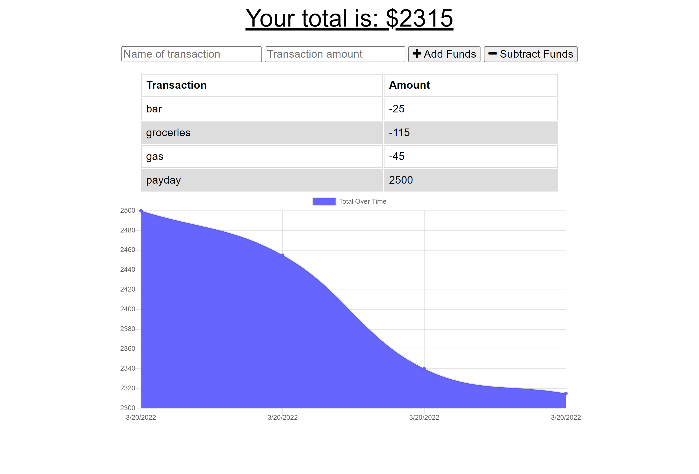

# Budget Tracker

## Description

This is a simple to use app that allows you to stay on top of your budget. This app allows you to keep track of your money even without a stable internet connection!

## Table of Contents   
    
* [Usage](#Usage)

* [License](#License)
* [Contributing](#Contributing)
* [Questions](#Questions)

## Usage

Follow the following link to the application. You can then save the app to the desktop or smart phone home screen.

Click on the app name to be taken to the app! [Budget Tracker](https://arcane-forest-95788.herokuapp.com/)

## License

This project is licensed under MIT

## Contributing

Created by Mark Miller
    

## Questions 

Click on my username to be directed to my GitHub profile. [Mark-Miller78](https://github.com/Mark-Miller78)
    
If you have any questions about this project, please feel free to reach out via email at markmiller7858@gmail.com